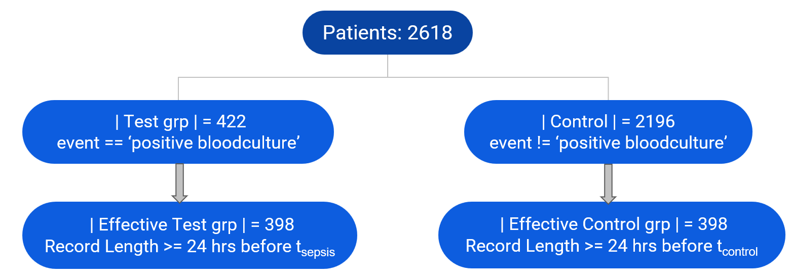
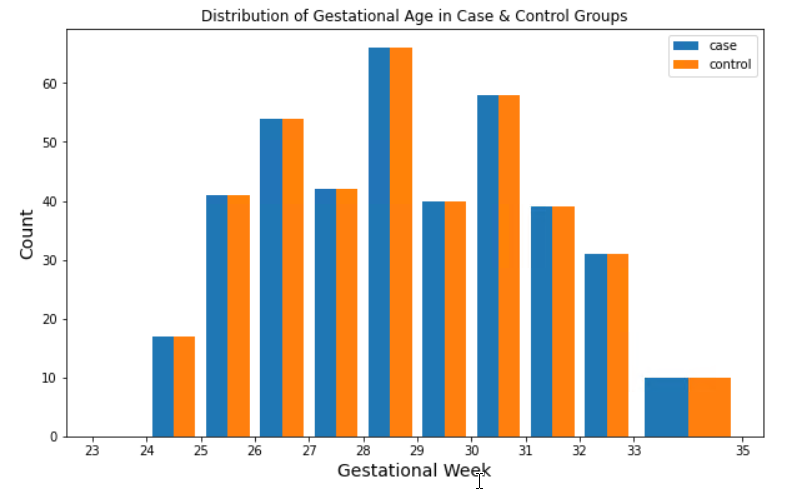
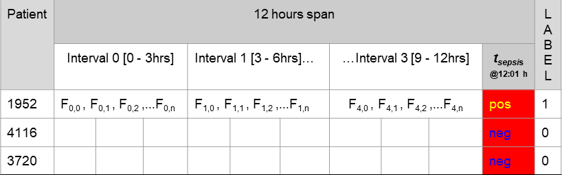
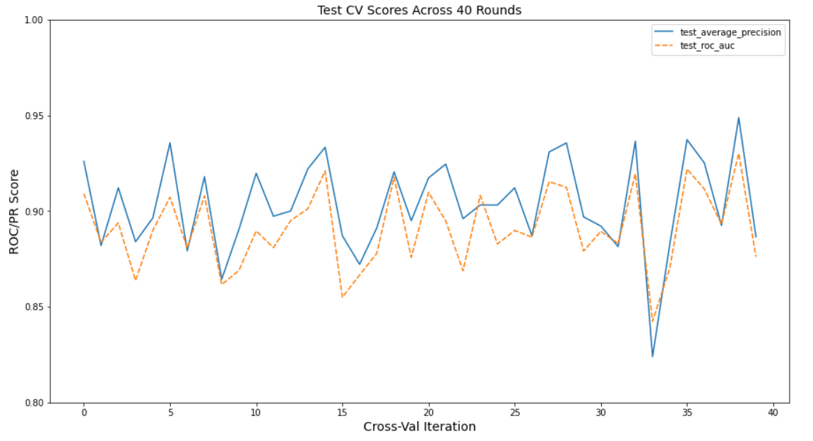
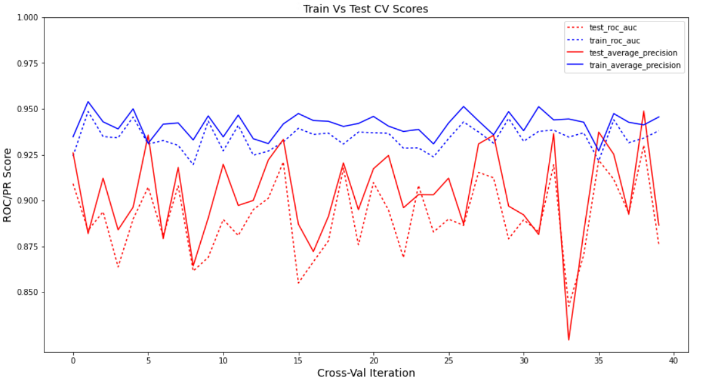
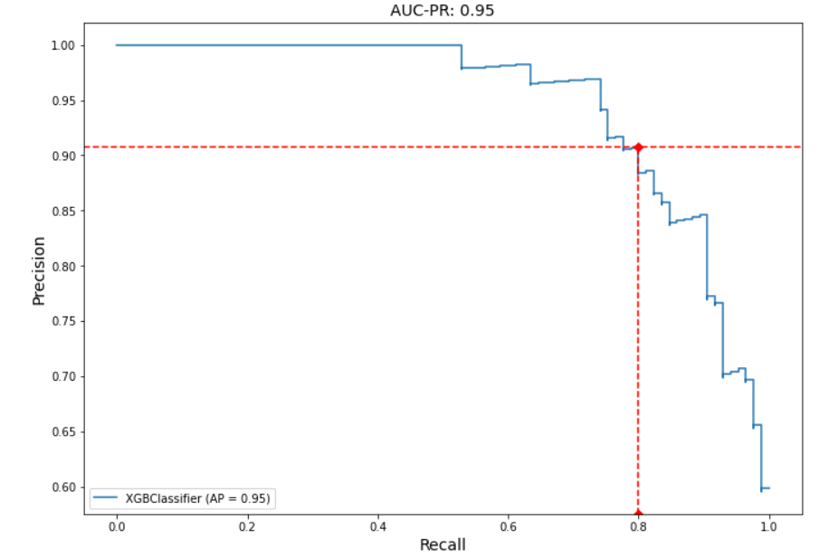

# UMC UTRECHT HOSPITAL: SEPSIS EARLY WARNING FOR PRETERM INFANTS
## INTRODUCTION
The data science team in UMC [Utrecht hospital](https://www.umcutrecht.nl/en) led by [Annemarie van 't Veen](https://www.linkedin.com/posts/annemarie-van-t-veen-5b62719_ai4health-studentchallenge-digitalhealth-activity-6947080636947943424-h13F?utm_source=linkedin_share&utm_medium=member_desktop_web), collaborated with [FruitPunch AI](https://www.fruitpunch.ai/), to develop an early warning model that would predict the onset of sepsis "acute infection" in preterm newborns, hospitalized in the neonatal intensive care unit (NICU).
This repo showcases the solution developed within the span of this project. Please, refer to the notebook below for a walkthrough:

or download the notebook in this repo at  
 <a href="./Modeling_Walkthrough.ipynb.ipynb" target="_blank">Modeling_Walkthrough.ipynb.ipynb</a> 
 

## PROBLEM STATMENT
The medical subject matter experts (SMEs) at UMC Utrecht children hospital [(WKZ)](https://www.hetwkz.nl/en), explain that preterm infants are more vulnurable to acute infections (sepsis) during their incubation term, which would lead to a higher infant mortality rate. The neonatal intensive care staff would benefit from an early warning system that alarms them to a possible sepsis case before it's onset, with an elaborate time frame for intervention. To this end, UMC Utrecht's data science team is interested in developing a model that predicts the onset of sepsis in preterm infants during incubation using the infant's record of physiological datastreams.

In this project, I've developed an XGboost timeseries classification model that predicts the onset of sepsis in preterm infants, within a 12-hour prediction horizon.

## DATA
UMC Utrecht data team provided an electronic health record (EHR) which included profile data, such as: ***{gender, gestation age}***. UMC Utrecht also provided a timeseries database recording 13 physiological markers, with `1` minute resolution. The physio-markers included: ***{Heart rate, Respiratory rate, Systolic blood pressure, Diabolic blood pressure, Rectal temperature, Incubator temperature,...etc}***. The database recorded the timestamps at which notable events occurred in an ``event`` feature. Notable events included: ***{Birth, Discharge, Positive blood culture, Negative blood culture, ...}***.

### FEATURES
The training features included 10 out of 13 physilogical features, plus 2 profile features, namely: ``gender`` and ``gestation age``. Below is the subset of features that were used in model training.

| **Training Features** |
| ------------------    | 
| Arterial Blood Pressure Diastole |
| Arterial Blood Pressure Systole  | 
| Incubator Measured Temperature   |
| Monitor Temperature              |
| Heart Rate Pulse                 |
| Heart rate Pleth                 |
| Monitor Heart Rate               |
| Respiratory Rate                 |
| O2 Saturation                    |
| Gestation Age |
| Gender |

#### MISSING DATA
Due to the nature of medical interaction with incubated newborns, not all physiological markers are continuously recorded thus resulting in significant volume of missing data for some features. Missing data could amount to more than 80% of a physiological marker. The mechanism driving missing data is often related to the technique of measurement, which mostly is invasive (i.e., requires penetration of an infant's skin). Invasion could present its own potential infection risk or might even be impossible due to the fragility of the tissues. Below is a graph of the percentage of data missingness per feature.

    
    <b><i>Fig-1: Missing Physiological Data</b></i>

Features with missing data exceeding 80% of their medical record were dropped entirely. Thus, the features {CRP Chemical, Nutrition, Rectal Temperature} were dropped leaving 10 physiological features for use out of the original 13.

### TARGETS
The targets used in model training were derived from the `event` feature. The positive label was set to the timestamp that corresponded to a `positive blood culture` event. A postive blood culture timestamp recorded the time at which the medical staff became ***suspicious*** of a sepsis development in an infant, thus ordering a blood culture, which happened to be positive, validating the suspicion.

The following rule summarizes how a timestamp is either positively or negatively labeled:

***t_sepsis***: The timestamp that matches a `positive blood culture` event, in a record of a case patient. 
***t_control***: A random timestamp within the closed interval `[12hrs, 60hrs]`, was selected from the record of a control (i.e., non-infected) patient.

#### NOTE: The labeling scheme implemented in UTC Utrecht, as of summer 2022, is different than the new ***Sepsis-3*** standard, which is widely adopted in recent sepsis AI solutions, [(Deng et al., 2021)](https://www.sciencedirect.com/science/article/pii/S2589004221016217). For an example on how "sepsis-3" is implemented in labeling timeseries data, refer to [Nemati et al. (2018)](https://www.ncbi.nlm.nih.gov/pmc/articles/PMC5851825/).

### DEFINING CONTROL AND CASE PATIENTS
The total number of patients were 2618 patients which were segmented into control and case groups. A case patient is an infant with no recorded sepsis suspicion during the length of their incubation in the NICU. A case patient is an infant who were suspected of developing sepsis at least once during their incubation, given that suspicion event was actually validated by a positive blood culture.

Out of the 2618 patients, 422 patients were identified as the case group, while 2196 patients composed the control pool. Furthermore, all patients with records shorter than 24 hours of physiological data were discarded. This left 398 patients in the case group.

 In order to maintain a balanced dataset, 398 control patients were pseudo randomly drawn from the 2196 control pool. The selection was constrained to match the distribution of the `gestation age` in the case group. Figure 2 shows the flowchart of data segmentation. 

     
    <b><i>Fig-2: Case & control groups segmentation</b></i>

Below is the distributions of gestation age and gender in both the case and control groups.

    
     
    <i><b>Fig-3: Left:</b> Gestation age distributions | <b>Right:</b> Gender distributions</i> 

### FEATURE ENGINEERING
Each of the 10 physiological markers was subset to the 12 hours of data that directly supersede a `t_sepsis` timestamp in a case patient, or `t_control` in a control patient. Over this extracted 12 hours segment, a sliding window of length 3 hours was run on every physio-marker to aggregate a set of 8 statistical features: {`mean`, `median`, `skew`, `kurtosis`, `standard deviation`, `variance`, `min`, `max`}. The following equation shows the total number of training features per patient:

*| F_phs | = 10 physiological  x 8 statistical x 4 Intervals (3hrs) = 320 features* 
Additionally, we added the `gestation age` as numeric and `gender`; one-hot-encoded into {`male`, `female`}, such that: 
*Feature_Vector = | F_phs | + `Gestation_Age` + `Male` + `Female`= 323 features* 

#### LABELS: The positive class `1` was assigned to a patient's feature vector if the extracted 12 hours of the patient's record do precede a `t_sepsis` timestamp. Otherwise, (i.e., the 12 hours segment precede a `t_control` event), the feature vector is assigned the negative class `0`.

Below is a representation of the constructed feature vectors and their labels.

     
    <b><i>Fig-4: </b>Feature vectors and their labels</i>

## MODEL DEVELOPMENT
### BASELINE & EVALUTION METRICS
UMC Utrecht developed a logistic regression classifier to classify timestamps into either `sepsis` or `not sepsis`. The logistic regression scored an AUCROC of 0.67. Later, the volunteering team of Fruitpunch was able to push this score to 0.71. This score was used as the baseline for model development.

The evaluation metrics are both the area under the precision-recall curve (AUCPR) and the area under the ROC curve (AUCROC).

### THE MODEL
In this project, the XGBoost classifier was used to perform timeseries classification of patients' records, with a 12 hours prediction horizon. XGBoost was selected based on its speed, robustness against missing data and its interpretability, especially with SHAP.

The model was trained and evaluated using a nested cross validation procedure to simultaneously search for the optimal parameters and evaluate the test scores. Both the inner and outer CV loops used `k = 4` and each loop was repeated 10 times. The inner loop used a random search over a set of probability distributions.
Below are the results of the cross validation:

    
     
     
    <i><b>Fig-5: Left:</b> Test scores per CV iteration | <b>Right:</b> Mean test AUCPR & AUCROC scores | <b>Bottom:</b> Train Vs test performance</i> 

#### AVERAGE PRECISION AND AUCROC IN THE OPTIMISTIC CASE

    
     
    <i><b>Fig-5: Left:</b> Average precision curve (0.95) | <b>Right:</b> ROC curve (0.93) </i> 

### EXPLAINABILTY WITH SHAP
[Simon Sukup](https://www.linkedin.com/in/%C5%A1imon-sukup-7574b4218/) developed a prediction interpretability analysis of the XGBoost model using SHAP.

